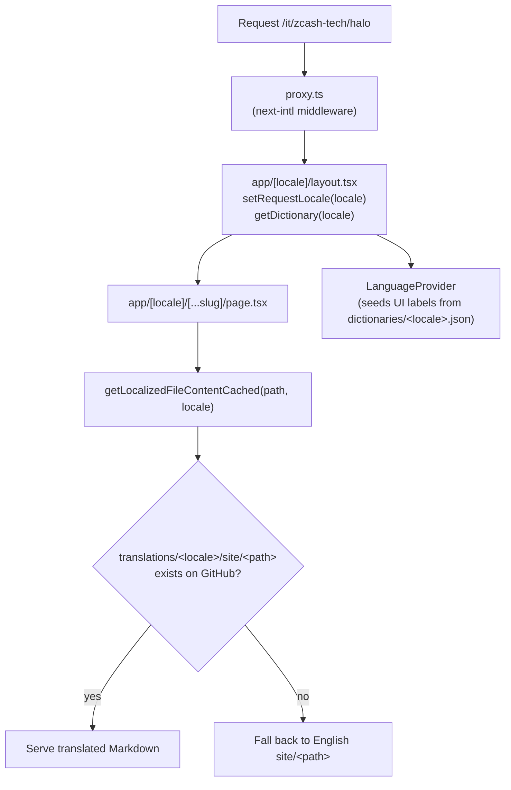

# Internationalization (i18n) architecture

This document explains how multilingual content works in the ZecHub Wiki so you
can contribute a translation — or extend the system — **without reading the
whole codebase**.

There are two kinds of contributor, and you probably only need one half of this
doc:

- **Translators** — you write Markdown and/or translate UI labels. Jump to
  [Adding a language](#adding-a-language). You do not need to understand the
  internals.
- **Developers** — you change how i18n works. Read
  [Architecture](#architecture) and [Invariants](#invariants-rules-that-keep-i18n-working)
  first.

---

## Two translation strategies (important)

The wiki serves non-English content **two different ways**, and they coexist:

| Strategy | Used for | Quality | SEO |
|----------|----------|---------|-----|
| **Curated** (next-intl) | Locales we ship real translations for (currently `it`) | Human-reviewed, exact | Indexable (`/it/...` URLs) |
| **Google Translate widget** (fallback) | Every other locale | Machine, on-the-fly | Not indexable |

A locale is **curated** when it is registered in `routing.ts` **and** listed in
`CURATED_LOCALES`. For curated locales the Google Translate widget is
deliberately **disabled**, because it would re-translate already-translated text
and corrupt proper nouns (e.g. "Paradigm" → "Paradigma"). The widget stays only
as a best-effort fallback for non-curated locales.

The rest of this document is about the **curated** path. The Google Translate
fallback needs no per-language work.

---

## Architecture

English lives at the root (`/start-here`); curated locales are prefixed
(`/it/start-here`). The route's `[locale]` segment drives everything downstream.



Two independent data sources feed a localized page:

1. **Page body** — Markdown fetched at runtime from the **content repo**
   ([`ZecHub/zechub`](https://github.com/ZecHub/zechub)) via the GitHub API
   (Octokit), cached with `unstable_cache`. Translations live in a *mirror tree*
   (see below).
2. **UI chrome** — menus, buttons, headings, etc. come from JSON **dictionaries**
   shipped in this repo (`dictionaries/<locale>.json`), surfaced through a React
   context.

### Where things live

| Path | Responsibility |
|------|----------------|
| `src/i18n/routing.ts` | **Source of truth for routed locales** — `locales`, `defaultLocale`, `localePrefix: "as-needed"`. |
| `src/i18n/config.ts` | Broad locale list for the Google Translate widget (the fallback path). Not the routed set. |
| `src/i18n/navigation.ts` | Locale-aware `Link`, `useRouter`, `usePathname`, `redirect` (from `createNavigation(routing)`). **Always import navigation from here.** |
| `src/i18n/request.ts` | Per-request next-intl config; loads `dictionaries/<locale>.json` as messages. |
| `src/proxy.ts` | next-intl middleware (adds/strips the locale prefix). |
| `src/app/[locale]/layout.tsx` | Sets the request locale and **preloads the dictionary** to seed the UI on the server (no English flash). |
| `src/app/[locale]/[...slug]/page.tsx` | Renders a content page; calls the localized fetch. |
| `src/lib/authAndFetch.ts` | `getLocalizedFileContentCached(path, locale)` + the translation probe/fallback logic. |
| `src/lib/getDictionary.ts` | Maps a locale → its dictionary JSON loader. |
| `src/context/LanguageContext.tsx` | Client UI-label context (`useLanguage().t`); defines `CURATED_LOCALES`. |
| `dictionaries/<locale>.json` | UI-chrome strings for one locale. |
| `src/constants/pageTitles.ts` | Locale → side-menu/sitemap page titles map. |
| `src/constants/*.<locale>.ts` | Per-locale copies of **data-driven** page content (exchanges, explorers, etc.). |

### Content fetch & fallback (`getLocalizedFileContentCached`)

For a curated locale, the fetch tries the mirror path first and falls back to
English so **every page always renders**, even if its translation doesn't exist
yet:

1. Probe `translations/<locale>/<path>` (short-TTL cache, so newly-added
   translations appear without a redeploy).
2. If missing, fuzzy-match the basename within the localized folder (handles
   filename casing differences) — **exact normalized match only**.
3. If still nothing, serve the English `site/<path>` (long-lived cache).

An empty translated file is treated as real content (served), not as "missing".

The content repo, branch, and token come from env vars: `OWNER`, `REPO`,
`BRANCH`, `GITHUB_TOKEN` (see [Local development](#local-development)).

---

## The mirror-tree content convention

Translated Markdown lives in the content repo under:

```
translations/<locale>/site/<exactly the same path as the English file>
```

Example:

```
site/Zcash_Tech/Halo.md                  ← English (source of truth)
translations/it/site/Zcash_Tech/Halo.md  ← Italian
```

Rules:

- **Mirror the path exactly** (same folders, same filename). The frontend derives
  the translated path from the English one.
- **Translate only what's ready.** Any file you don't create falls back to
  English automatically — partial translations are fine and safe to ship.
- **Respect protected terms** (brand/protocol names that must never be
  translated). See
  [docs/translation-protected-terms.md](./translation-protected-terms.md) and the
  validator (`scripts/check-protected-terms.mjs`) in the content repo.

---

## UI chrome (dictionaries)

Menus, buttons, and component labels are **not** in the Markdown — they live in
`dictionaries/<locale>.json`, keyed by section (`menuLabels`, `exploreMenu`,
`common`, `navigation`, `pages`, `sideMenu`, `meta`, …). The English file
`dictionaries/en.json` is the canonical key set; every other dictionary mirrors
its keys.

Components read labels through `useLanguage().t` (client) and the dictionary is
**seeded on the server** in `app/[locale]/layout.tsx`, so the correct language
renders during SSR. Any key missing from a locale's dictionary falls back to
English.

---

## Invariants (rules that keep i18n working)

These are non-negotiable; breaking them silently drops users out of their
locale (the bugs are invisible because the code still compiles and works in
English).

1. **Never import navigation from `next/link` or `next/navigation`.**
   Always use `@/i18n/navigation`:

   ```ts
   // ✅ locale-aware — preserves /it/ on internal links
   import { Link, useRouter, usePathname } from "@/i18n/navigation";

   // ❌ drops the locale prefix on curated locales
   import Link from "next/link";
   import { useRouter, usePathname } from "next/navigation";
   ```

   `@/i18n/navigation`'s `Link` only prefixes protocol-less `/` paths; external
   URLs, `mailto:`/`tel:`, anchors, and protocol-relative `//host` links pass
   through unchanged, so it is a safe drop-in everywhere.

2. **Path matching must use the locale-stripped pathname.** `usePathname` from
   `@/i18n/navigation` returns `/welcome` on both `/welcome` and `/it/welcome`.
   Code that compares the path against a constant (e.g. route exemptions) must
   use this, not the raw `next/navigation` pathname.

3. **Build absolute/canonical URLs with the locale prefix** for non-default
   locales (e.g. share/OG URLs), or they'll point at the English page.

4. **Dictionary keys are append-only and English-complete.** Add the key to
   `dictionaries/en.json` first; other locales fall back to it.

---

## Adding a language

Say you want to add **Spanish (`es`)** as a curated locale. The content side is
pure translation; the frontend side is a short, fixed list of registration
points (no architecture changes needed).

### A. Content (translators) — content repo `ZecHub/zechub`

1. Create `translations/es/site/...` mirroring the English `site/` tree. Start
   with any subset; untranslated files fall back to English.
2. Keep protected terms intact (run the protected-terms validator).
3. Update `translations/TRANSLATION_STATUS.md` (or regenerate it via the status
   script) so progress is visible.

### B. Frontend registration (developers) — this repo

Each step is mechanical and localized to one place:

1. **Route the locale** — add `"es"` to `locales` in `src/i18n/routing.ts`.
2. **Mark it curated** — add `'es'` to `CURATED_LOCALES` in
   `src/context/LanguageContext.tsx` (disables the Google Translate widget for it).
3. **UI dictionary** — copy `dictionaries/en.json` → `dictionaries/es.json` and
   translate the values, then register a loader for it in
   `src/lib/getDictionary.ts`.
4. **Side-menu / sitemap titles** — create
   `src/constants/pageTitles.es.ts` and register it under the `es` key in
   `src/constants/pageTitles.ts`.
5. **Data-driven pages** — for each `src/constants/*.it.ts` (exchanges,
   explorers, community projects, DEX listings, …), create the `*.es.ts`
   equivalent and add it to the `byLocale` map in the matching `ClientPage.tsx`.
6. **Translated Markdown** — ensure the content repo has `translations/es/site/…`
   (step A).

That's the complete list. Anything you forget degrades gracefully to English
rather than breaking — but the steps above are what make Spanish a
fully first-class, indexable locale.

> Tip: grep the codebase for `it` / `pageTitlesIt` / `CURATED_LOCALES` to see
> every touch-point with a concrete example to copy.

---

## Local development

Point the app at a content repo/branch that has your translations and run the
dev server:

```bash
# .env.local
OWNER=<github-owner-of-content-repo>
REPO=zechub
BRANCH=<branch-with-your-translations>
GITHUB_TOKEN=<a-github-token>
```

```bash
yarn dev
# English:  http://localhost:3000/start-here
# Italian:  http://localhost:3000/it/start-here
```

Because the page body is fetched from GitHub at request time, you can iterate on
translations by pushing to `BRANCH` — no frontend redeploy needed (the
translation probe uses a short cache TTL).
