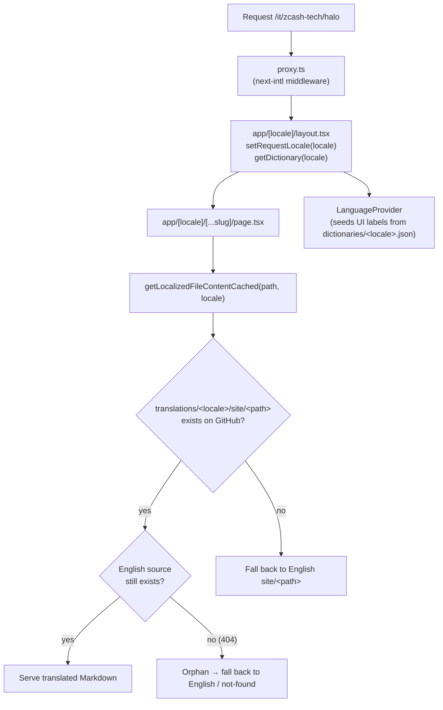

# Translating ZecHub

How multilingual content works, and how to add or update a language — for
translators and developers.

You probably only need one half of this doc:

- **Translators** — you write Markdown and/or translate UI labels. Read
  [How it works](#how-it-works-one-curated-path) and jump to
  [Adding a language](#adding-a-language). You don't need the internals.
- **Developers** — you change how i18n works. Read [Architecture](#architecture)
  and [Invariants](#invariants-rules-that-keep-i18n-working).

---

## How it works: one curated path

Every non-English page you see is **curated** — human-written, human-reviewed
Markdown, served on a real indexable URL (`/it/zcash-tech/halo`) through
[next-intl](https://next-intl.dev/). There is exactly **one** translation path.

> **There is no machine-translation fallback.** The wiki used to run a runtime
> Google Translate widget for locales without curated content. That widget has
> been **removed** — it loaded a third-party script, wasn't indexable, and
> corrupted proper nouns (e.g. "Paradigm" → "Paradigma"). Now every language in
> the switcher ships curated content.

The direct consequence: **a curated page is exactly what a reader sees, with no
safety net, until it is re-synced.** If the English source changes and a
translation isn't updated, that locale silently serves stale content. That is
why the content repo has a [staleness & sync system](#keeping-translations-current-staleness--sync).

Currently 18 curated locales ship: `it, fr, es, de, pt, ar, zh, hi, ru, ja, ko,
tr, uk` (LLM-translated) and `sw, yo, ig, ak, ee` (machine-translated baseline).

---

## Architecture

English lives at the root (`/start-here`); other locales are prefixed
(`/it/start-here`). The route's `[locale]` segment drives everything downstream.



Two independent data sources feed a localized page:

1. **Page body** — Markdown fetched at runtime from the **content repo**
   ([`ZecHub/zechub`](https://github.com/ZecHub/zechub)) via the GitHub API
   (Octokit), cached with `unstable_cache`. Translations live in a *mirror tree*
   (see below).
2. **UI chrome** — menus, buttons, headings, etc. come from JSON **dictionaries**
   shipped in this repo (`dictionaries/<locale>.json`), surfaced through a React
   context.

### Where things live

| Path | Responsibility |
|------|----------------|
| `src/i18n/routing.ts` | **Source of truth for routed locales** — `locales`, `defaultLocale`, `localePrefix: "as-needed"`. |
| `src/i18n/config.ts` | Declares the `Locale` type and the `i18n` object (`defaultLocale` + `locales`) consumed by the dictionary loader (`getDictionary`). Keep its `locales` in sync with `routing.ts`. (No longer any Google Translate role — that widget is gone.) |
| `src/i18n/navigation.ts` | Locale-aware `Link`, `useRouter`, `usePathname`, `redirect` (from `createNavigation(routing)`). **Always import navigation from here.** |
| `src/i18n/request.ts` | Per-request next-intl config; loads `dictionaries/<locale>.json` as messages. |
| `src/proxy.ts` | next-intl middleware (adds/strips the locale prefix). |
| `src/app/[locale]/layout.tsx` | Sets the request locale, **preloads the dictionary** (no English flash), and sets `<html lang>`/`dir` (RTL via `RTL_LOCALES`). |
| `src/app/[locale]/[...slug]/page.tsx` | Renders a content page; calls the localized fetch. |
| `src/lib/authAndFetch.ts` | `getLocalizedFileContentCached(path, locale)` + the translation probe, English-fallback, and orphan guard. |
| `src/lib/getDictionary.ts` | Maps a locale → its dictionary JSON loader. |
| `src/context/LanguageContext.tsx` | Client UI-label context (`useLanguage().t`) and `LANGUAGES` (the switcher list). The URL (`useLocale()`) is the sole locale driver — no `localStorage`, no widget gate. |
| `dictionaries/<locale>.json` | UI-chrome strings for one locale. |
| `src/constants/pageTitles.ts` | Locale → side-menu/sitemap page titles map. |
| `src/constants/*.<locale>.ts` | Per-locale copies of **data-driven** page content (exchanges, explorers, etc.). |

### Content fetch, fallback & orphan guard (`getLocalizedFileContentCached`)

For a non-English locale the fetch resolves a page like this, so **every page
always renders**:

1. Probe `translations/<locale>/<path>` (short-TTL cache, so newly-added
   translations appear without a redeploy).
2. If missing, fuzzy-match the basename within the localized folder (handles
   filename casing differences) — **exact normalized match only**.
3. **Orphan guard.** If a translation is found, confirm the English source
   `site/<path>` still exists before serving it. If the source is *definitively*
   gone (a real 404 — the English page was deleted upstream and only the stale
   translation lingers), the translation is **refused** and the page falls back
   to English / not-found, so readers never see permanently-stale content. A
   *transient* fetch failure (network / 5xx / rate limit) is treated as
   "unknown" and the translation is still served — a GitHub blip can't 404 a
   live page.
4. If no translation, serve the English `site/<path>` (long-lived cache).

An empty translated file is treated as real content (served), not "missing".

The content repo, branch, and token come from env vars: `OWNER`, `REPO`,
`BRANCH`, `GITHUB_TOKEN` (see [Local development](#local-development)).

---

## The mirror-tree content convention

Translated Markdown lives in the content repo under:

```
translations/<locale>/site/<exactly the same path as the English file>
```

Example:

```
site/Zcash_Tech/Halo.md                  ← English (source of truth)
translations/it/site/Zcash_Tech/Halo.md  ← Italian
```

Rules:

- **Mirror the path exactly** (same folders, same filename). The frontend derives
  the translated path from the English one.
- **Translate only what's ready.** Any file you don't create falls back to
  English automatically — partial translations are fine and safe to ship.
- **Respect protected terms** (brand/protocol names that must never be
  translated). See the content repo's `translation/protected-terms.json` and the
  validator (`scripts/check-protected-terms.mjs`).

---

## UI chrome (dictionaries)

Menus, buttons, and component labels are **not** in the Markdown — they live in
`dictionaries/<locale>.json`, keyed by section (`menuLabels`, `exploreMenu`,
`common`, `navigation`, `pages`, `sideMenu`, `meta`, …). The English file
`dictionaries/en.json` is the canonical key set; every other dictionary mirrors
its keys.

Components read labels through `useLanguage().t` (client) and the dictionary is
**seeded on the server** in `app/[locale]/layout.tsx`, so the correct language
renders during SSR. Any key missing from a locale's dictionary falls back to
English.

---

## Invariants (rules that keep i18n working)

These are non-negotiable; breaking them silently drops users out of their locale
(the bugs are invisible because the code still compiles and works in English).

1. **Never import navigation from `next/link` or `next/navigation`.**
   Always use `@/i18n/navigation`:

   ```ts
   // ✅ locale-aware — preserves /it/ on internal links
   import { Link, useRouter, usePathname } from "@/i18n/navigation";

   // ❌ drops the locale prefix
   import Link from "next/link";
   import { useRouter, usePathname } from "next/navigation";
   ```

   `@/i18n/navigation`'s `Link` only prefixes protocol-less `/` paths; external
   URLs, `mailto:`/`tel:`, anchors, and protocol-relative `//host` links pass
   through unchanged, so it is a safe drop-in everywhere.

2. **Path matching must use the locale-stripped pathname.** `usePathname` from
   `@/i18n/navigation` returns `/welcome` on both `/welcome` and `/it/welcome`.
   Code that compares the path against a constant (e.g. route exemptions) must
   use this, not the raw `next/navigation` pathname.

3. **Build absolute/canonical URLs with the locale prefix** for non-default
   locales (e.g. share/OG URLs), or they'll point at the English page.

4. **Dictionary keys are append-only and English-complete.** Add the key to
   `dictionaries/en.json` first; other locales fall back to it.

5. **The URL is the only locale driver.** Chrome, `<html lang>`, and `dir`
   follow `useLocale()`. Don't reintroduce `localStorage` persistence — it can
   pin the UI to a different language than the routed content.

---

## Adding a language

Say you want to add **Spanish (`es`)**. The content side is pure translation; the
frontend side is a short, fixed list of registration points (no architecture
changes needed).

### A. Content (translators) — content repo `ZecHub/zechub`

1. Create `translations/es/site/...` mirroring the English `site/` tree. Start
   with any subset; untranslated files fall back to English.
2. Keep protected terms intact (run the protected-terms validator).
3. **Seed the staleness manifest.** Add an `es` block to
   `translation/sync-state.json` by running the repo's
   `translation/seed-sync-state.mjs`. Without it the blocking invariant CI fails
   and the [staleness dashboard](#keeping-translations-current-staleness--sync)
   won't track the new locale.
4. Update `translations/TRANSLATION_STATUS.md` (or regenerate it) so progress is
   visible.

### B. Frontend registration (developers) — this repo

Each step is mechanical and localized to one place:

1. **Route the locale** — add `"es"` to `locales` in `src/i18n/routing.ts`, and
   to `i18n.locales` in `src/i18n/config.ts` (keep the two in sync).
2. **Switcher entry** — add an `es` entry to `LANGUAGES` in
   `src/context/LanguageContext.tsx` (label, native label, flag; set
   `dir: 'rtl'` for right-to-left languages). For an RTL language also add it to
   `RTL_LOCALES` in `src/app/[locale]/layout.tsx`.
3. **UI dictionary** — copy `dictionaries/en.json` → `dictionaries/es.json`,
   translate the values, and register a loader in `src/lib/getDictionary.ts`.
4. **Side-menu / sitemap titles** — create `src/constants/pageTitles.es.ts` and
   register it under the `es` key in `src/constants/pageTitles.ts`.
5. **Data-driven pages** — for each `src/constants/*.it.ts` (exchanges,
   explorers, community projects, DEX listings, …), create the `*.es.ts`
   equivalent and add it to the `byLocale` map in the matching `ClientPage.tsx`.
6. **Translated Markdown** — ensure the content repo has `translations/es/site/…`
   (step A).

Anything you forget degrades gracefully to English rather than breaking — but the
steps above are what make Spanish a fully first-class, indexable locale.

> Tip: grep the codebase for `it` / `pageTitlesIt` to see every touch-point with
> a concrete example to copy.

---

## Keeping translations current (staleness & sync)

Because there's no machine-translation fallback anymore, a stale curated page is
served as-is until someone re-syncs it. The **content repo** (`ZecHub/zechub`)
owns a system to keep translations current — you don't run any of it from this
frontend repo, but it's useful to know it exists:

- A per-locale **source-hash manifest** (`translation/sync-state.json`) records
  the English source each translation was made from.
- A GitHub Action detects when English changes and publishes a pinned
  **"Translation staleness dashboard"** issue (stale / missing / orphaned pages
  per locale), plus a blocking CI check that keeps the manifest honest.
- A weekly operator job opens **`i18n sync` PRs** — diff-aware retranslation for
  the 13 LLM locales (only the changed English blocks are re-translated) and
  whole-page regeneration for the 5 machine locales. **Orphaned** translations
  (English source deleted) are deleted, matching the frontend's orphan guard.

For the full design and how to run it, see the content repo's
`translation/README-sync.md`.

---

## Local development

Point the app at a content repo/branch that has your translations and run the
dev server:

```bash
# .env.local
OWNER=<github-owner-of-content-repo>
REPO=zechub
BRANCH=<branch-with-your-translations>
GITHUB_TOKEN=<a-github-token>
```

```bash
yarn dev
# English:  http://localhost:3000/start-here
# Italian:  http://localhost:3000/it/start-here
```

Because the page body is fetched from GitHub at request time, you can iterate on
translations by pushing to `BRANCH` — no frontend redeploy needed (the
translation probe uses a short cache TTL).
